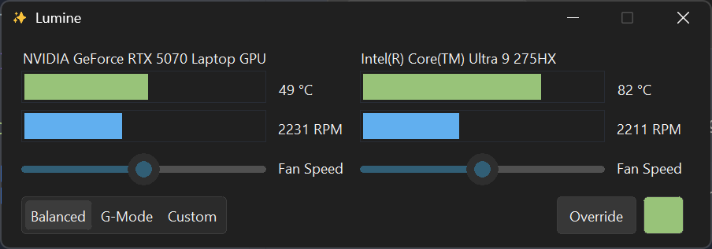
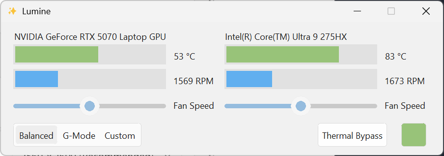

# ✨ Lumine

- Huge thanks to @AlexIII for the original [Thermal Control Center](https://github.com/AlexIII/tcc-g15).


Open-source alternative to AWCC (Dell’s Alienware Command Center)

[Download latest release](https://github.com/Stevesuk0/Lumine/releases)




<br/>

> Liked this app? Helping by spreading the word and leaving the project a star ⭐

> Find some problem? Please report that by creating an [issue](https://github.com/AlexIII/tcc-g15/issues). Feedback is always welcome!

**AWCC, Mean Dell's damn "Alienware Control Center".*

## Target Platform

Supported models:
- Dell G15: 5511, 5515, 5520, 5525, 5530, 5535, 5590
- Dell Alienware m16 R1
- Dell G3 3590
- Dell Alienware 16X Aurora AC16251

May also work on other Dell / Alienware laptops.

Please report if it worked / didn't work for you. Your feedback is highly appreciated.

## What It Can Do

- ✔️ Switch thermal mode between Balanced, G-Mode, and Custom
- ✔️ Show GPU/CPU temperature and fan speed
- ✔️ Semi-manual fan speed control
- ✔️ Automatically enable G-mode when GPU/CPU temperature reaches critical
- ✔️ Support for keyboard G-mode hotkey

## Limitations

- Fan control is not fully manual. The BIOS may override settings if temperatures become unsafe.

- In rare cases, GPU temperature readings may be incorrect. [See this issue of TCC-G15](https://github.com/AlexIII/tcc-g15/issues/9)

- Switching between `G-Mode` and other modes may cause a brief system-wide freeze (about 1 second). This is a known limitation of Dell’s thermal interface and **cannot** be fixed.

## Why AWCC Is Frustrating
No built-in `G-Mode` toggle. you need workarounds just to control it properly
Fan control settings often do not work as expected
Heavy and slow UI for very basic functionality
Reported telemetry behavior without opt-out options
Frequent crashes and instability
Sometimes refuses to launch when needed most.

If Lumine works well for you, you can safely remove:

- Alienware Command Center components
- Alienware Command Center Suite
- Alienware OC Controls

## How It Works

Lumine is a Tkinter-based GUI that interacts with Dell’s WMI thermal control interface.

Much of the underlying research comes from [@AlexIII's documentation](https://github.com/AlexIII/tcc-g15/blob/master/WMI-AWCC-doc.md).

## How to Run from the Source

This program requires administrator privileges to run, so the examples below use [`sudo`](https://learn.microsoft.com/windows/advanced-settings/sudo/).

I use [`uv`](https://docs.astral.sh/uv) to manage the Python environment, so you’ll need to install it first:

```bash
pip install uv
```
Next, clone the repository and set up the environment:

```bash
git clone https://github.com/Stevesuk0/Lumine.git && cd Lumine

uv sync

.venv\Scripts\activate
```

Run

```bash
sudo uv run src\lumine.py
```

## About the AWCC Telemetry

AWCC is reported to send telemetry data without an opt-out option.

I know it's probably not going to surprise anyone, given the times we're living in, 
but AWCC silently sends some telemetry without the possibility of opting out.

The telemetry is being sent to these URLs:

```
https://tm-sdk.platinumai.net
https://qa-external-tm.plawebsvc01.net
```

## Credits

Big thanks to the amazing people who have contributed to the project:
- @AlexIII's [Thermal Control Center](https://github.com/AlexIII/tcc-g15)
- @AprDeci for code / new features
- @T7imal, @cemkaya-mpi, @THSLP13, @Terryxtl for testing and debugging
- @Dtwpurple, @WinterholdPrime, @Dhia-zorai, @fraPCI for compatibility reports

## Special Thanks

Lumine is built on top of [tcc-g15](https://github.com/AlexIII/tcc-g15).

Special thanks to its author for implementing the WMI-based thermal control interface that made this project possible.

---

## License

GPL v3 © Stevesuk
