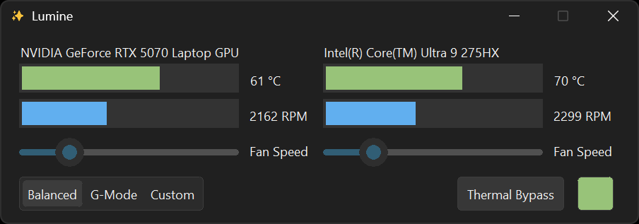
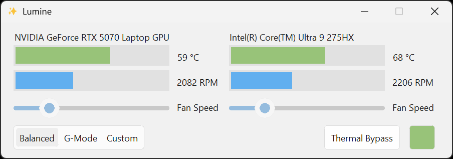

# ✨ Lumine

- Huge thanks to @AlexIII's [Thermal Control Center](https://github.com/AlexIII/tcc-g15)

Open-source alternative to AWCC*

[Download link](https://github.com/Stevesuk0/Lumine/releases)




<br/>

> Liked this app? Helping by spreading the word and leaving the project a star ⭐

> Find some problem? Please report that by creating an [issue](https://github.com/AlexIII/tcc-g15/issues). Feedback is always welcome!

**AWCC, Mean Dell's damn "Alienware Control Center".*

## Target Platform

Supported models:
- Dell G15: 5511, 5515, 5520, 5525, 5530, 5535, 5590
- Dell Alienware m16 R1
- Dell G3 3590
- Dell Alienware 16X Aurora AC16251

May also work on other Dell / Alienware laptops.

Please report if it worked / didn't work for you. Your feedback is highly appreciated.

## What It Can Do

- ✔️ Switch thermal mode between Balanced, G-Mode, and Custom
- ✔️ Show GPU/CPU temperature and fan speed
- ✔️ Semi-manual fan speed control
- ✔️ Automatically enable G-mode when GPU/CPU temperature reaches critical
- ✔️ Support for keyboard G-mode hotkey

## Limitations

- Manual fan control is not *really* manual. If you set fan speed too low, the BIOS will take over and raise the fan speed automatically when the GPU/CPU temperature reaches a certain point to prevent overheating.

- On rare occasions, the driver may report bogus GPU temperature. [See this issue.](https://github.com/AlexIII/tcc-g15/issues/9)

- Switching the thermal mode to "G-mode" and back **may result in a second-long system-wide freeze** (at the exact moment when the switch is happening). This is a known issue with Dell's thermal control interface. Cannot be fixed. Make sure to disable the fail-safe feature if you don't want the app to switch the thermal mode automatically.

# Why AWCC Sucks

- ❌ No in-app option to toggle G-Mode — you have to mess with other tools just to switch it off

- ❌ Manual fan control is broken — changing the settings does nothing

- ❌ Bloated and sluggish — flashy UI, but can’t even handle basic functions properly

- ❌ Secretly collects user data (see AWCC Telemetry Details)

- ❌ Crashes often — you’ll see more error pop-ups than actual performance gains

- ❌ ****I can never get it to open when I need it.****

If this alternative works out for you, you can safely remove from your PC:

- Alieanware CC Components
- Alieanware Command Center Suite
- Alieanware OC Controls

## How It Works

It is a Tkinter GUI for the WMI Dell thermal control interface.

@AlexIII have somewhat documented his findings on the WMI [here](https://github.com/AlexIII/tcc-g15/blob/master/WMI-AWCC-doc.md).

## How to Run from the Source

This program requires administrator privileges to run, so the examples below use [`sudo`](https://learn.microsoft.com/windows/advanced-settings/sudo/).

I use [`uv`](https://docs.astral.sh/uv) to manage the Python environment, so you’ll need to install it first:

```bash
pip install uv
```
Next, clone the repository and set up the environment:

```bash
git clone https://github.com/Stevesuk0/Lumine.git && cd Lumine

uv sync

.venv\Scripts\activate
```

Run

```bash
sudo python3 src\lumine.py
```

## About the AWCC Telemetry

I know it's probably not going to surprise anyone, given the times we're living in, 
but AWCC silently sends some telemetry without the possibility of opting out.

The telemetry is being sent to these URLs:

```
https://tm-sdk.platinumai.net
https://qa-external-tm.plawebsvc01.net
```

## Credits

Big thanks to the amazing people who have contributed to the project:
- @AlexIII's [Thermal Control Center](https://github.com/AlexIII/tcc-g15)
- @AprDeci for code / new features
- @T7imal, @cemkaya-mpi, @THSLP13, @Terryxtl for testing and debugging
- @Dtwpurple, @WinterholdPrime, @Dhia-zorai, @fraPCI for compatibility reports

## License

© github.com/Stevesuk

GPL v3
